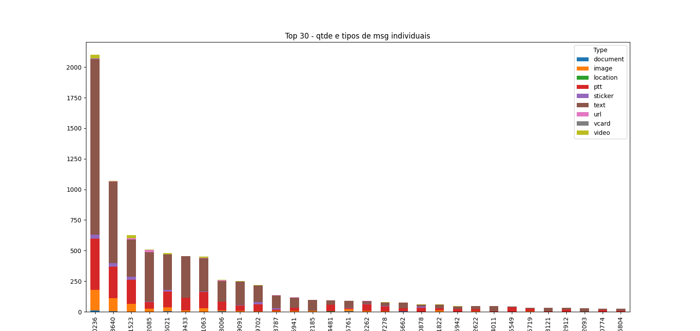

# zapy
## Ferramenta forense para a organização de metadados do WhatsApp

## Introdução

O WhatsApp fornece os metadados das comunicações realizadas com o app em atendimento a ordem judicial de afastamento do sigilo telemático.

O programa ZAPI lê os e-mails que contêm tais metadados e organiza numa planilha Excel a informação fornecida, facilitando sua análise pelo investigador ou interessado. 

Também consulta a api IPAPI para a obtenção de informações adicionais relacionadas aos IPs coletados, tais como 'hostname', 'latitude', 'longitude', 'cidade' e 'região'.

Podem ser gerados gráficos para facilitar a análise do caso.




## Instalação (no Windows)

1. Crie a pasta para a aplicação e nela copie o arquivo "app.py".
2. Navegue até a pasta e crie o ambiente virtual
```
python -m venv env  
```
3. Ative o ambiente virtual
```
env\Scripts\activate.bat  
```
4. Instale as dependências
```
pip install -r requirements.txt  
```
5. Crie/edite o arquivo .env com a chave da API (obtida em [ipapi.com](ipapi.com)), no formato
```
chave = '5050e9exxxxxxxxxxxxxxxxxxxxf9e84'
```

## Uso

1. Crie a pasta de trabalho.
1. Mova para os arquivos 'eml' para a pasta de trabalho.
    - Opcionalmente, com o uso do MS Outlook, exporte um lote de emails no formato 'txt'. O programa dará preferência à leitura desse arquivo.
1. Rode a aplicação.
- O programa perguntará:
    - se você deseja restringir a consulta da API; e
    - se você deseja gerar gráficos para análise dos dados coletados.

## Observações

As sugestões para o aprimoramento do programa são muito bem-vindas.
